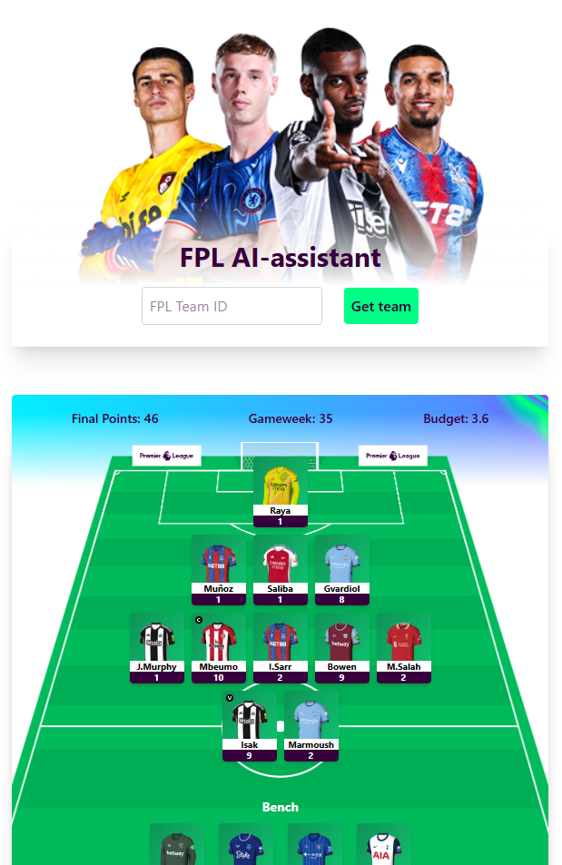

# 🧠⚽️ FPL AI Assistant

An AI-powered Fantasy Premier League assistant built to analyze your FPL team and suggest optimized transfers, captain picks, and chip usage – all in a sleek, responsive UI.

## ⚙️ Features

- 🔍 Fetches your current FPL team by entering your Team ID
- 🤖 Sends your team to OpenAI for customized weekly suggestions
- 📊 Displays JSON-structured advice for transfers, chips, and notes
- 👕 Players rendered on a responsive football pitch (bench included)
- 🛠 Built with TypeScript, React, Tailwind CSS, FastAPI & OpenAI API

## 📦 Project Structure

This is a monorepo containing:

- `fpl-ai-assistant.client` – Frontend in React + TypeScript + Tailwind
- `fpl-ai-assistant.server` – Backend in FastAPI + Python + OpenAI API

## 🚀 Getting Started

### 1. Clone the repo

```bash
git clone https://github.com/PatricAngly/fpl-ai-assistant.git
cd fpl-ai-assistant
```

### 2. Install frontend (client)

```bash
cd fpl-ai-assistant.client
npm install
npm run dev
```

### 3. Install backend (server)

```bash
cd ../fpl-ai-assistant.server
python -m venv venv
source venv/bin/activate  # or venv\Scripts\activate on Windows
pip install -r requirements.txt
uvicorn main:app --reload
```

### 4. Add environment variables

```bash
Create a .env file in fpl-ai-assistant.server/:
OPENAI_API_KEY=your-openai-api-key
```

## 📸 Screenshots

### ⚽️ Team View



### 🧠 AI Advice View


## 🔮 Coming Soon

- 💰 **Bank balance analysis**
- 🔄 **Free transfers analysis**
- 📊 **Player history & fixture difficulty integration**
- 📈 **Live stats & expected points**
- 🕰️ **Historic trend analysis**

## 👨🏽‍💻 Built by

Patric Angly - https://github.com/PatricAngly
